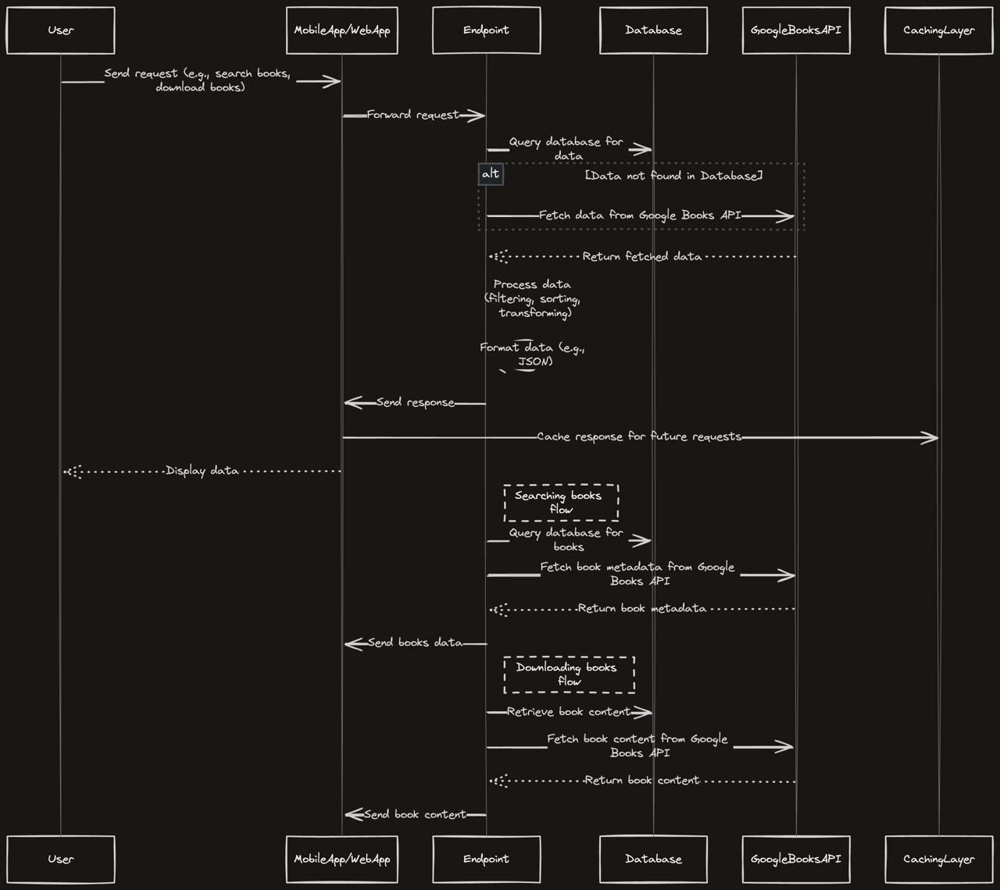

## HCI Library API

The HCI Library API is a comprehensive library management system built with FastAPI, SQLAlchemy, and PostgreSQL and Redis for caching. This API allows users to manage their book collections, fetch books from the Google Books API, create user profiles, bookmark books, and store user preferences

### Prerequisites

- Docker
- Docker Compose
- Python 3.12.4


## Project 

```
├── Alembic
│   ├── README
│   ├── env.py
│   ├── script.py.mako
│   └── versions
├── Makefile
├── README.md
├── alembic.ini
├── app
│   ├── app.py
│   ├── core
│   │   ├── db.py
│   │   └── logger.py
│   ├── models
│   │   ├── audiobook.py
│   │   ├── book.py
│   │   ├── bookmark.py
│   │   └── user.py
│   └── routes
├── docker
│   ├── Dockerfile
│   ├── Dockerfile.local
│   └── docker-compose.yml
└── requirements.txt
```

### High-Level Overview of API Model



### nstallation

1. Clone the repository:

   ```sh
   git clone git@github.com:0xDVC/hci-library-api.git
   cd hci-library-api
   ```
2. Create a `.env` file based on the `.env.sample` file:

   ```sh
   cp venv/.env.sample .env
   ```
3. Update the `.env` file with your environment variables.

### Setting Up the Project Locally

1. Create a virtual environment and install dependencies:

   ```sh
   python3 -m venv venv
   source venv/bin/activate
   pip install -r requirements.txt
   ```
2. Apply database migrations:

   ```sh
   alembic upgrade head
   ```
3. Start the application:

   ```sh
   uvicorn app.app:app --reload
   ```
4. The API will be available at `http://localhost:8000`.

### Running the Application with Docker

1. Build and start the Docker containers:

   ```sh
   docker-compose up --build
   ```
2. The API will be available at `http://localhost:8080`.

### Database Migrations

1. To create a new migration, run:

   ```sh
   alembic revision --autogenerate -m "Migration message"
   ```
2. To apply migrations, run:

   ```sh
   alembic upgrade head
   ```

### License

This project is licensed under the MIT License.


__This project is still under construction__
